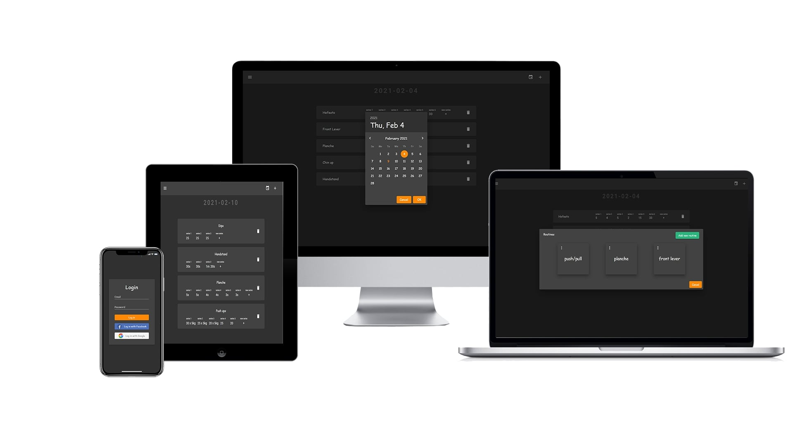
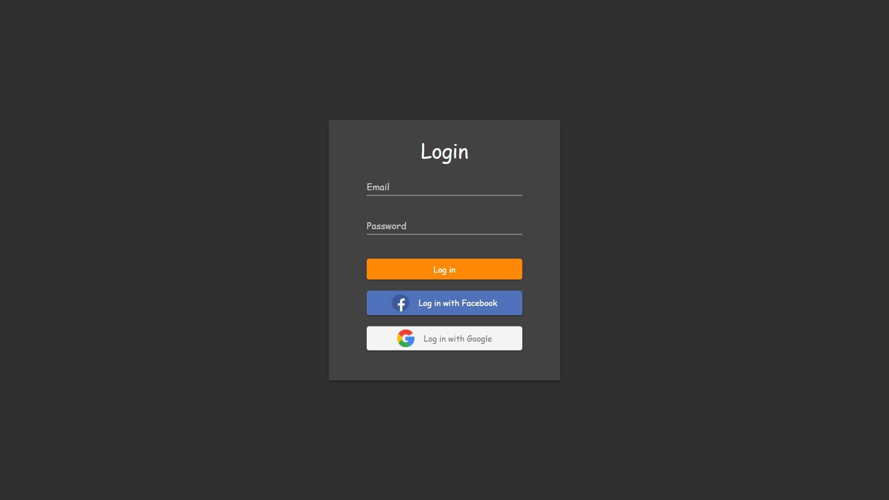
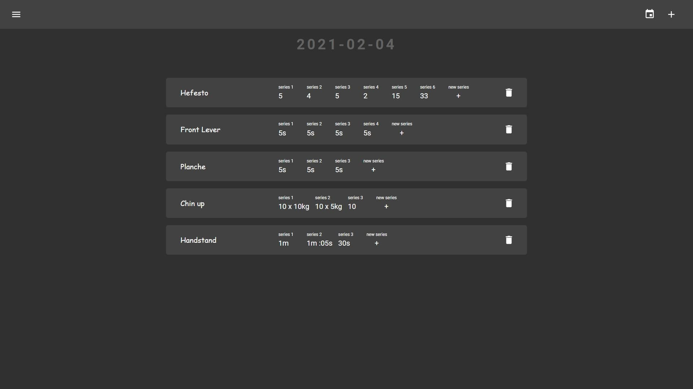
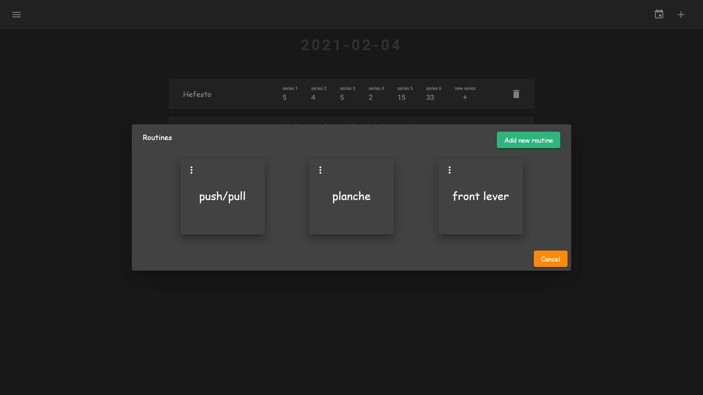
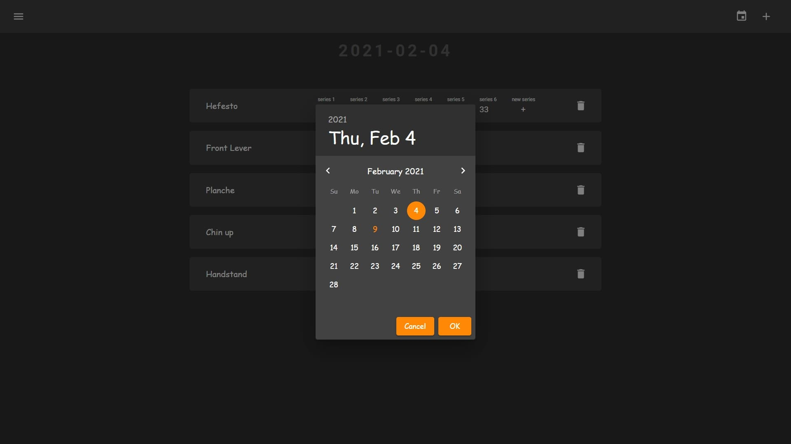
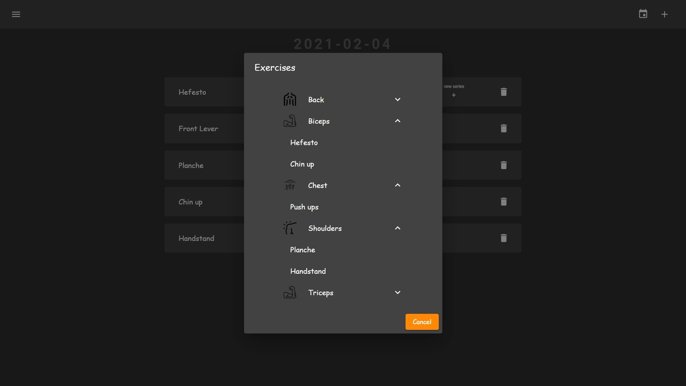

## Calisthenic_Dictonary

The application allows you to keep a training diary. You can create your own routines as well as monitor your workouts by adding series. Website created by Next.js, Typescript, Strapi

## Demo

https://calisthenic-dictonary.vercel.app/

## Technologies

- Next 10.0.4
- React 17.0.1
- TypeScript 4.1.3
- Redux 4.0.5
- react-redux 7.2.2
- Axios 0.21.1
- Nookies 2.5.0
- Formik & Yup
- Material-ui/core: 4.11.2
- Nprogress 0.2.0
- Material-ui/pickers 3.2.10

## Features

- Login to account
- Login with Google and Facebook
- Create new routines, add to them exercises
- Create training, add to them exercises or routines
- Add series in training

## Screenshots

